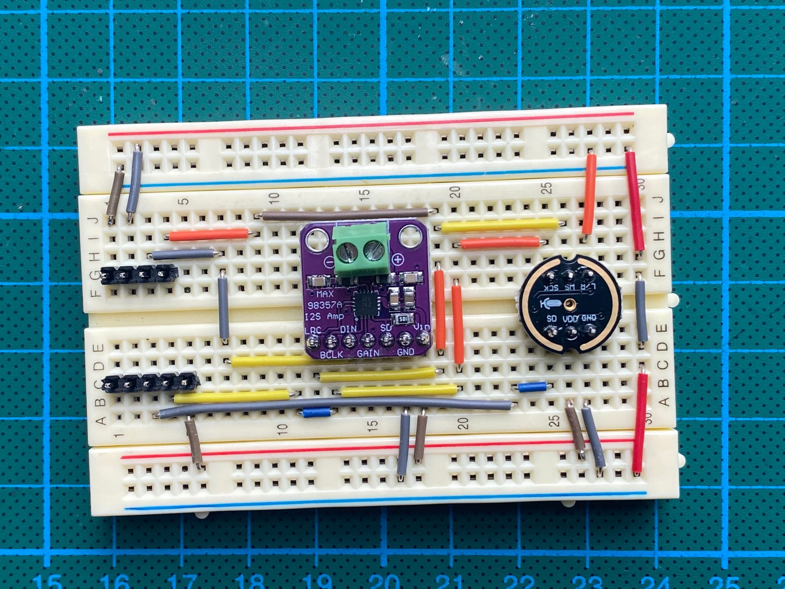
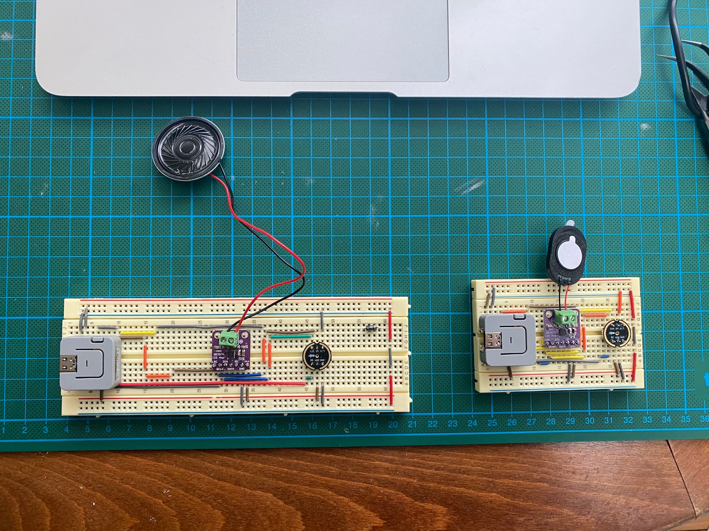

# Overview
Forked from [M5Atom Walkie Talkie](https://github.com/febalci/m5atom-walkie-talkie) by febalci which is further forked from [ESP32 Walkie Talkie](https://github.com/atomic14/esp32-walkie-talkie) by atomic14.

This is the M5StickC Plus version of the same project.

### Required Hardware

* 2 sets of M5StickC Plus
* 2 sets of i2s amplifier
* 2 sets of 4 or 8 Ohm Speaker (Min 3W preferred)

*If you use a breadboard, try to use shorter jumper cables since long or low quality jumper cables cause too much interference and noise for the INMP441 microphone.

*You can use Speaker HAT **2** which uses i2s, not a normal Speaker HAT because internal ADC and DAC can be exclusively used and this project uses ADC for internal PDM microphone.

<p align="center">

</p>

# Setup

Audio data is transmitted over either UDP broadcast or ESP-NOW. So the Walkie-Talkie will even work without a WiFi network!

Everything is configured from the `src/config.h` file. To use UDP Broadcast comment out the line:

```
#define USE_ESP_NOW
```

If you use UDP instead of ESP-NOW, make sure you update the WiFi SSID and Password:

```
// WiFi credentials
#define WIFI_SSID << YOUR_SSID >>
#define WIFI_PSWD << YOUR_PASSWORD >>
```

The pins for the microphone and the amplifier board are all setup in the same `config.h` file.

# Building and Running

PlatformIO is required for this project so you will need to have that installed. Open up the project and connect your M5Atom. You should be able to just hit build and run.

<p align="center">

</p>

# To be added

1. Select high performance (louder) small size speakers
2. Prepare a PCB which also stabilizes power for less noise 
3. Prepare a 3D print enclosure
4. Publish the code on github (It is a mess now, have to tidy it up)
5. Home Assistant interface (Possibilities are endless)
6. Batteries ?

*Thanks once again to atomic14 for this great project...
